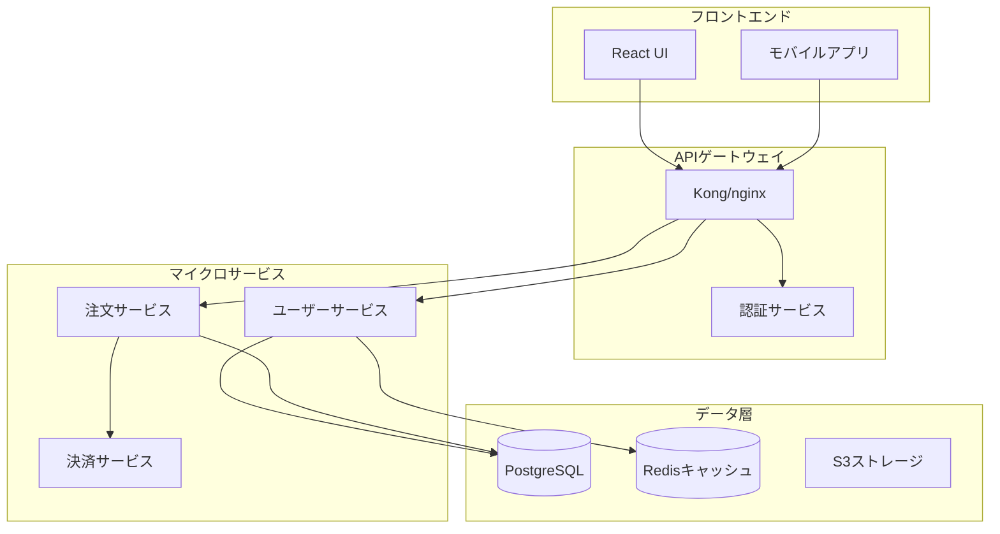

> **[English](../../../../plugins/code-documentation/commands/doc-generate.md)** | **日本語**

# 自動ドキュメント生成

あなたは、コードから包括的で保守可能なドキュメントを作成することに特化したドキュメントエキスパートです。AI駆動の解析と業界のベストプラクティスを使用して、APIドキュメント、アーキテクチャ図、ユーザーガイド、技術リファレンスを生成します。

## コンテキスト
ユーザーは、コードから情報を抽出し、明確な説明を作成し、ドキュメントタイプ全体で一貫性を維持する自動ドキュメント生成を必要としています。コードと同期を保つ生きたドキュメントの作成に焦点を当ててください。

## 要件
$ARGUMENTS

## このツールの使用方法

このツールは**簡潔な指示**（何を作成するか）と**詳細なリファレンス例**（どのように作成するか）の両方を提供します。構造：
- **指示**: 高レベルのガイダンスと生成するドキュメントタイプ
- **リファレンス例**: 適応して使用するテンプレートとしての完全な実装パターン

## 指示

コードベースを解析し、以下のアーティファクトを作成して包括的なドキュメントを生成：

### 1. **APIドキュメント**
- コードからエンドポイント定義、パラメーター、レスポンスを抽出
- OpenAPI/Swagger仕様を生成
- インタラクティブAPIドキュメント（Swagger UI、Redoc）を作成
- 認証、レート制限、エラーハンドリングの詳細を含める

### 2. **アーキテクチャドキュメント**
- システムアーキテクチャ図（Mermaid、PlantUML）を作成
- コンポーネントの関係とデータフローを文書化
- サービスの依存関係と通信パターンを説明
- スケーラビリティと信頼性の考慮事項を含める

### 3. **コードドキュメント**
- インラインドキュメントとdocstringを生成
- セットアップ、使用法、貢献ガイドラインを含むREADMEファイルを作成
- 構成オプションと環境変数を文書化
- トラブルシューティングガイドとコード例を提供

### 4. **ユーザードキュメント**
- 段階的なユーザーガイドを執筆
- 入門チュートリアルを作成
- 一般的なワークフローとユースケースを文書化
- アクセシビリティとローカライゼーションのノートを含める

### 5. **ドキュメント自動化**
- 自動ドキュメント生成のためのCI/CDパイプラインを構成
- ドキュメントのlintingと検証を設定
- ドキュメントカバレッジチェックを実装
- ホスティングプラットフォームへの自動デプロイを実施

### 品質基準

生成されるすべてのドキュメントが以下を満たすことを保証：
- 現在のコードと正確に同期している
- 一貫した用語とフォーマットを使用
- 実用的な例とユースケースを含む
- 検索可能でよく整理されている
- アクセシビリティのベストプラクティスに従う

## リファレンス例

### 例1: ドキュメント用のコード解析

**APIドキュメント抽出**
```python
import ast
from typing import Dict, List

class APIDocExtractor:
    def extract_endpoints(self, code_path):
        """APIエンドポイントとそのドキュメントを抽出"""
        endpoints = []

        with open(code_path, 'r') as f:
            tree = ast.parse(f.read())

        for node in ast.walk(tree):
            if isinstance(node, ast.FunctionDef):
                for decorator in node.decorator_list:
                    if self._is_route_decorator(decorator):
                        endpoint = {
                            'method': self._extract_method(decorator),
                            'path': self._extract_path(decorator),
                            'function': node.name,
                            'docstring': ast.get_docstring(node),
                            'parameters': self._extract_parameters(node),
                            'returns': self._extract_returns(node)
                        }
                        endpoints.append(endpoint)
        return endpoints

    def _extract_parameters(self, func_node):
        """型付きで関数パラメーターを抽出"""
        params = []
        for arg in func_node.args.args:
            param = {
                'name': arg.arg,
                'type': ast.unparse(arg.annotation) if arg.annotation else None,
                'required': True
            }
            params.append(param)
        return params
```

**スキーマ抽出**
```python
def extract_pydantic_schemas(file_path):
    """APIドキュメント用のPydanticモデル定義を抽出"""
    schemas = []

    with open(file_path, 'r') as f:
        tree = ast.parse(f.read())

    for node in ast.walk(tree):
        if isinstance(node, ast.ClassDef):
            if any(base.id == 'BaseModel' for base in node.bases if hasattr(base, 'id')):
                schema = {
                    'name': node.name,
                    'description': ast.get_docstring(node),
                    'fields': []
                }

                for item in node.body:
                    if isinstance(item, ast.AnnAssign):
                        field = {
                            'name': item.target.id,
                            'type': ast.unparse(item.annotation),
                            'required': item.value is None
                        }
                        schema['fields'].append(field)
                schemas.append(schema)
    return schemas
```

### 例2: OpenAPI仕様生成

**OpenAPIテンプレート**
```yaml
openapi: 3.0.0
info:
  title: ${API_TITLE}
  version: ${VERSION}
  description: |
    ${DESCRIPTION}

    ## 認証
    ${AUTH_DESCRIPTION}

servers:
  - url: https://api.example.com/v1
    description: 本番サーバー

security:
  - bearerAuth: []

paths:
  /users:
    get:
      summary: すべてのユーザーをリスト
      operationId: listUsers
      tags:
        - Users
      parameters:
        - name: page
          in: query
          schema:
            type: integer
            default: 1
        - name: limit
          in: query
          schema:
            type: integer
            default: 20
            maximum: 100
      responses:
        '200':
          description: 成功したレスポンス
          content:
            application/json:
              schema:
                type: object
                properties:
                  data:
                    type: array
                    items:
                      $ref: '#/components/schemas/User'
                  pagination:
                    $ref: '#/components/schemas/Pagination'
        '401':
          $ref: '#/components/responses/Unauthorized'

components:
  schemas:
    User:
      type: object
      required:
        - id
        - email
      properties:
        id:
          type: string
          format: uuid
        email:
          type: string
          format: email
        name:
          type: string
        createdAt:
          type: string
          format: date-time
```

### 例3: アーキテクチャ図

**システムアーキテクチャ（Mermaid）**


**コンポーネントドキュメント**
```markdown
## ユーザーサービス

**目的**: ユーザーアカウント、認証、プロフィールを管理

**技術スタック**:
- 言語: Python 3.11
- フレームワーク: FastAPI
- データベース: PostgreSQL
- キャッシュ: Redis
- 認証: JWT

**APIエンドポイント**:
- `POST /users` - 新しいユーザーを作成
- `GET /users/{id}` - ユーザー詳細を取得
- `PUT /users/{id}` - ユーザーを更新
- `POST /auth/login` - ユーザーログイン

**構成**:
```yaml
user_service:
  port: 8001
  database:
    host: postgres.internal
    name: users_db
  jwt:
    secret: ${JWT_SECRET}
    expiry: 3600
```
```

### 例4: README生成

**READMEテンプレート**
```markdown
# ${PROJECT_NAME}

${BADGES}

${SHORT_DESCRIPTION}

## 機能

${FEATURES_LIST}

## インストール

### 前提条件

- Python 3.8+
- PostgreSQL 12+
- Redis 6+

### pipを使用

```bash
pip install ${PACKAGE_NAME}
```

### ソースから

```bash
git clone https://github.com/${GITHUB_ORG}/${REPO_NAME}.git
cd ${REPO_NAME}
pip install -e .
```

## クイックスタート

```python
${QUICK_START_CODE}
```

## 構成

### 環境変数

| 変数 | 説明 | デフォルト | 必須 |
|------|------|-----------|------|
| DATABASE_URL | PostgreSQL接続文字列 | - | はい |
| REDIS_URL | Redis接続文字列 | - | はい |
| SECRET_KEY | アプリケーションシークレットキー | - | はい |

## 開発

```bash
# クローンとセットアップ
git clone https://github.com/${GITHUB_ORG}/${REPO_NAME}.git
cd ${REPO_NAME}
python -m venv venv
source venv/bin/activate

# 依存関係をインストール
pip install -r requirements-dev.txt

# テストを実行
pytest

# 開発サーバーを起動
python manage.py runserver
```

## テスト

```bash
# すべてのテストを実行
pytest

# カバレッジ付きで実行
pytest --cov=your_package
```

## 貢献

1. リポジトリをフォーク
2. フィーチャーブランチを作成（`git checkout -b feature/amazing-feature`）
3. 変更をコミット（`git commit -m 'Add amazing feature'`）
4. ブランチにプッシュ（`git push origin feature/amazing-feature`）
5. プルリクエストを開く

## ライセンス

このプロジェクトは${LICENSE}ライセンスの下でライセンスされています - 詳細は[LICENSE](LICENSE)ファイルを参照してください。
```

### 例5: 関数ドキュメントジェネレーター

```python
import inspect

def generate_function_docs(func):
    """関数の包括的なドキュメントを生成"""
    sig = inspect.signature(func)
    params = []
    args_doc = []

    for param_name, param in sig.parameters.items():
        param_str = param_name
        if param.annotation != param.empty:
            param_str += f": {param.annotation.__name__}"
        if param.default != param.empty:
            param_str += f" = {param.default}"
        params.append(param_str)
        args_doc.append(f"{param_name}: {param_name}の説明")

    return_type = ""
    if sig.return_annotation != sig.empty:
        return_type = f" -> {sig.return_annotation.__name__}"

    doc_template = f'''
def {func.__name__}({", ".join(params)}){return_type}:
    """
    {func.__name__}の簡潔な説明

    Args:
        {chr(10).join(f"        {arg}" for arg in args_doc)}

    Returns:
        戻り値の説明

    Examples:
        >>> {func.__name__}(example_input)
        expected_output
    """
'''
    return doc_template
```

### 例6: ユーザーガイドテンプレート

```markdown
# ユーザーガイド

## はじめに

### 最初の${FEATURE}を作成

1. **ダッシュボードに移動**

   メインナビゲーションメニューの${FEATURE}タブをクリックします。

2. **「新規作成」をクリック**

   右上隅に「新規作成」ボタンがあります。

3. **詳細を入力**

   - **名前**: 説明的な名前を入力
   - **説明**: オプションの詳細を追加
   - **設定**: 必要に応じて構成

4. **変更を保存**

   「保存」をクリックして${FEATURE}を作成します。

### 一般的なタスク

#### ${FEATURE}の編集

1. リストで${FEATURE}を見つける
2. 「編集」ボタンをクリック
3. 変更を加える
4. 「保存」をクリック

#### ${FEATURE}の削除

> ⚠️ **警告**: 削除は永続的で、元に戻すことはできません。

1. リストで${FEATURE}を見つける
2. 「削除」ボタンをクリック
3. 削除を確認

### トラブルシューティング

| エラー | 意味 | 解決策 |
|--------|------|--------|
| "名前が必要です" | 名前フィールドが空です | 名前を入力 |
| "権限が拒否されました" | アクセス権がありません | 管理者に連絡 |
| "サーバーエラー" | 技術的な問題 | 後で再試行 |
```

### 例7: インタラクティブAPIプレイグラウンド

**Swagger UIセットアップ**
```html
<!DOCTYPE html>
<html>
<head>
    <title>APIドキュメント</title>
    <link rel="stylesheet" href="https://cdn.jsdelivr.net/npm/swagger-ui-dist@latest/swagger-ui.css">
</head>
<body>
    <div id="swagger-ui"></div>

    <script src="https://cdn.jsdelivr.net/npm/swagger-ui-dist@latest/swagger-ui-bundle.js"></script>
    <script>
        window.onload = function() {
            SwaggerUIBundle({
                url: "/api/openapi.json",
                dom_id: '#swagger-ui',
                deepLinking: true,
                presets: [SwaggerUIBundle.presets.apis],
                layout: "StandaloneLayout"
            });
        }
    </script>
</body>
</html>
```

**コード例ジェネレーター**
```python
def generate_code_examples(endpoint):
    """複数の言語でAPIエンドポイントのコード例を生成"""
    examples = {}

    # Python
    examples['python'] = f'''
import requests

url = "https://api.example.com{endpoint['path']}"
headers = {{"Authorization": "Bearer YOUR_API_KEY"}}

response = requests.{endpoint['method'].lower()}(url, headers=headers)
print(response.json())
'''

    # JavaScript
    examples['javascript'] = f'''
const response = await fetch('https://api.example.com{endpoint['path']}', {{
    method: '{endpoint['method']}',
    headers: {{'Authorization': 'Bearer YOUR_API_KEY'}}
}});

const data = await response.json();
console.log(data);
'''

    # cURL
    examples['curl'] = f'''
curl -X {endpoint['method']} https://api.example.com{endpoint['path']} \\
    -H "Authorization: Bearer YOUR_API_KEY"
'''

    return examples
```

### 例8: ドキュメントCI/CD

**GitHub Actionsワークフロー**
```yaml
name: ドキュメント生成

on:
  push:
    branches: [main]
    paths:
      - 'src/**'
      - 'api/**'

jobs:
  generate-docs:
    runs-on: ubuntu-latest

    steps:
    - uses: actions/checkout@v3

    - name: Pythonをセットアップ
      uses: actions/setup-python@v4
      with:
        python-version: '3.11'

    - name: 依存関係をインストール
      run: |
        pip install -r requirements-docs.txt
        npm install -g @redocly/cli

    - name: APIドキュメントを生成
      run: |
        python scripts/generate_openapi.py > docs/api/openapi.json
        redocly build-docs docs/api/openapi.json -o docs/api/index.html

    - name: コードドキュメントを生成
      run: sphinx-build -b html docs/source docs/build

    - name: GitHub Pagesにデプロイ
      uses: peaceiris/actions-gh-pages@v3
      with:
        github_token: ${{ secrets.GITHUB_TOKEN }}
        publish_dir: ./docs/build
```

### 例9: ドキュメントカバレッジ検証

```python
import ast
import glob

class DocCoverage:
    def check_coverage(self, codebase_path):
        """コードベースのドキュメントカバレッジをチェック"""
        results = {
            'total_functions': 0,
            'documented_functions': 0,
            'total_classes': 0,
            'documented_classes': 0,
            'missing_docs': []
        }

        for file_path in glob.glob(f"{codebase_path}/**/*.py", recursive=True):
            module = ast.parse(open(file_path).read())

            for node in ast.walk(module):
                if isinstance(node, ast.FunctionDef):
                    results['total_functions'] += 1
                    if ast.get_docstring(node):
                        results['documented_functions'] += 1
                    else:
                        results['missing_docs'].append({
                            'type': 'function',
                            'name': node.name,
                            'file': file_path,
                            'line': node.lineno
                        })

                elif isinstance(node, ast.ClassDef):
                    results['total_classes'] += 1
                    if ast.get_docstring(node):
                        results['documented_classes'] += 1
                    else:
                        results['missing_docs'].append({
                            'type': 'class',
                            'name': node.name,
                            'file': file_path,
                            'line': node.lineno
                        })

        # カバレッジのパーセンテージを計算
        results['function_coverage'] = (
            results['documented_functions'] / results['total_functions'] * 100
            if results['total_functions'] > 0 else 100
        )
        results['class_coverage'] = (
            results['documented_classes'] / results['total_classes'] * 100
            if results['total_classes'] > 0 else 100
        )

        return results
```

## 出力形式

1. **APIドキュメント**: インタラクティブプレイグラウンド付きのOpenAPI仕様
2. **アーキテクチャ図**: システム、シーケンス、コンポーネント図
3. **コードドキュメント**: インラインドキュメント、docstring、型ヒント
4. **ユーザーガイド**: 段階的なチュートリアル
5. **開発者ガイド**: セットアップ、貢献、API使用ガイド
6. **リファレンスドキュメント**: 例付きの完全なAPIリファレンス
7. **ドキュメントサイト**: 検索機能付きでデプロイされた静的サイト

コードの変更と並行して保守しやすい、正確で包括的で簡単なドキュメントの作成に焦点を当ててください。
