# プルリクエスト強化

効率的なコードレビューを促進する高品質プルリクエストの作成を専門とするPR最適化エキスパートです。包括的なPR説明の生成、レビュープロセスの自動化、明確性、サイズ、レビュー容易性のためのPRベストプラクティスへの準拠を確保します。

## コンテキスト
ユーザーは、詳細な説明、適切なドキュメンテーション、テストカバレッジ分析、レビュー促進を含むプルリクエストを作成または改善する必要があります。レビューしやすく、適切に文書化され、必要なすべてのコンテキストを含むPRの作成に焦点を当てます。

## 要件
$ARGUMENTS

## 手順

### 1. PR分析

変更を分析してインサイトを生成:

**変更サマリージェネレーター**
```python
import subprocess
import re
from collections import defaultdict

class PRAnalyzer:
    def analyze_changes(self, base_branch='main'):
        """
        現在のブランチとベースブランチ間の変更を分析
        """
        analysis = {
            'files_changed': self._get_changed_files(base_branch),
            'change_statistics': self._get_change_stats(base_branch),
            'change_categories': self._categorize_changes(base_branch),
            'potential_impacts': self._assess_impacts(base_branch),
            'dependencies_affected': self._check_dependencies(base_branch)
        }

        return analysis

    def _get_changed_files(self, base_branch):
        """変更されたファイルのリストを統計情報とともに取得"""
        cmd = f"git diff --name-status {base_branch}...HEAD"
        result = subprocess.run(cmd.split(), capture_output=True, text=True)

        files = []
        for line in result.stdout.strip().split('\n'):
            if line:
                status, filename = line.split('\t', 1)
                files.append({
                    'filename': filename,
                    'status': self._parse_status(status),
                    'category': self._categorize_file(filename)
                })

        return files

    def _get_change_stats(self, base_branch):
        """詳細な変更統計を取得"""
        cmd = f"git diff --shortstat {base_branch}...HEAD"
        result = subprocess.run(cmd.split(), capture_output=True, text=True)

        # Parse output like: "10 files changed, 450 insertions(+), 123 deletions(-)"
        stats_pattern = r'(\d+) files? changed(?:, (\d+) insertions?\(\+\))?(?:, (\d+) deletions?\(-\))?'
        match = re.search(stats_pattern, result.stdout)

        if match:
            files, insertions, deletions = match.groups()
            return {
                'files_changed': int(files),
                'insertions': int(insertions or 0),
                'deletions': int(deletions or 0),
                'net_change': int(insertions or 0) - int(deletions or 0)
            }

        return {'files_changed': 0, 'insertions': 0, 'deletions': 0, 'net_change': 0}

    def _categorize_file(self, filename):
        """ファイルをタイプ別に分類"""
        categories = {
            'source': ['.js', '.ts', '.py', '.java', '.go', '.rs'],
            'test': ['test', 'spec', '.test.', '.spec.'],
            'config': ['config', '.json', '.yml', '.yaml', '.toml'],
            'docs': ['.md', 'README', 'CHANGELOG', '.rst'],
            'styles': ['.css', '.scss', '.less'],
            'build': ['Makefile', 'Dockerfile', '.gradle', 'pom.xml']
        }

        for category, patterns in categories.items():
            if any(pattern in filename for pattern in patterns):
                return category

        return 'other'
```

### 2. PR説明生成

包括的なPR説明を作成:

**説明テンプレートジェネレーター**
```python
def generate_pr_description(analysis, commits):
    """
    分析から詳細なPR説明を生成
    """
    description = f"""
## 概要

{generate_summary(analysis, commits)}

## 変更内容

{generate_change_list(analysis)}

## 変更理由

{extract_why_from_commits(commits)}

## 変更タイプ

{determine_change_types(analysis)}

## テスト方法

{generate_test_section(analysis)}

## ビジュアル変更

{generate_visual_section(analysis)}

## パフォーマンス影響

{analyze_performance_impact(analysis)}

## 破壊的変更

{identify_breaking_changes(analysis)}

## 依存関係

{list_dependency_changes(analysis)}

## チェックリスト

{generate_review_checklist(analysis)}

## 追加メモ

{generate_additional_notes(analysis)}
"""
    return description

def generate_summary(analysis, commits):
    """エグゼクティブサマリーを生成"""
    stats = analysis['change_statistics']

    # コミットから主な目的を抽出
    main_purpose = extract_main_purpose(commits)

    summary = f"""
このPRは{main_purpose}。

**影響**: {stats['files_changed']}ファイル変更（{stats['insertions']}行追加、{stats['deletions']}行削除）
**リスクレベル**: {calculate_risk_level(analysis)}
**レビュー時間**: 約{estimate_review_time(stats)}分
"""
    return summary

def generate_change_list(analysis):
    """カテゴリ別変更リストを生成"""
    changes_by_category = defaultdict(list)

    for file in analysis['files_changed']:
        changes_by_category[file['category']].append(file)

    change_list = ""
    icons = {
        'source': '🔧',
        'test': '✅',
        'docs': '📝',
        'config': '⚙️',
        'styles': '🎨',
        'build': '🏗️',
        'other': '📁'
    }

    for category, files in changes_by_category.items():
        change_list += f"\n### {icons.get(category, '📁')} {category.title()}の変更\n"
        for file in files[:10]:  # カテゴリごとに10ファイルまで
            change_list += f"- {file['status']}: `{file['filename']}`\n"
        if len(files) > 10:
            change_list += f"- ...他{len(files) - 10}ファイル\n"

    return change_list
```

### 3. レビューチェックリスト生成

自動化されたレビューチェックリストを作成:

**スマートチェックリストジェネレーター**
```python
def generate_review_checklist(analysis):
    """
    コンテキスト認識レビューチェックリストを生成
    """
    checklist = ["## レビューチェックリスト\n"]

    # 一般項目
    general_items = [
        "コードがプロジェクトのスタイルガイドラインに従っている",
        "セルフレビュー完了",
        "複雑なロジックにコメント追加",
        "デバッグコードが残っていない",
        "機密データが公開されていない"
    ]

    # 一般項目を追加
    checklist.append("### 一般")
    for item in general_items:
        checklist.append(f"- [ ] {item}")

    # ファイル固有チェック
    file_types = {file['category'] for file in analysis['files_changed']}

    if 'source' in file_types:
        checklist.append("\n### コード品質")
        checklist.extend([
            "- [ ] コード重複なし",
            "- [ ] 関数が焦点を絞り小さい",
            "- [ ] 変数名が説明的",
            "- [ ] エラーハンドリングが包括的",
            "- [ ] パフォーマンスボトルネックが導入されていない"
        ])

    if 'test' in file_types:
        checklist.append("\n### テスト")
        checklist.extend([
            "- [ ] すべての新しいコードがテストでカバーされている",
            "- [ ] テストが意味があり単なるカバレッジ目的でない",
            "- [ ] エッジケースがテストされている",
            "- [ ] テストがAAAパターン（Arrange、Act、Assert）に従っている",
            "- [ ] 不安定なテストが導入されていない"
        ])

    if 'config' in file_types:
        checklist.append("\n### 設定")
        checklist.extend([
            "- [ ] ハードコードされた値なし",
            "- [ ] 環境変数が文書化されている",
            "- [ ] 後方互換性が維持されている",
            "- [ ] セキュリティへの影響がレビュー済み",
            "- [ ] デフォルト値が適切"
        ])

    if 'docs' in file_types:
        checklist.append("\n### ドキュメンテーション")
        checklist.extend([
            "- [ ] ドキュメンテーションが明確で正確",
            "- [ ] 役立つ例が提供されている",
            "- [ ] API変更が文書化されている",
            "- [ ] 必要に応じてREADMEが更新されている",
            "- [ ] CHANGELOGが更新されている"
        ])

    # セキュリティチェック
    if has_security_implications(analysis):
        checklist.append("\n### セキュリティ")
        checklist.extend([
            "- [ ] SQLインジェクション脆弱性なし",
            "- [ ] 入力検証が実装されている",
            "- [ ] 認証/認可が正しい",
            "- [ ] ログに機密データなし",
            "- [ ] 依存関係が安全"
        ])

    return '\n'.join(checklist)
```

### 4. コードレビュー自動化

一般的なレビュータスクを自動化:

**自動化レビューボット**
```python
class ReviewBot:
    def perform_automated_checks(self, pr_diff):
        """
        自動化されたコードレビューチェックを実施
        """
        findings = []

        # 一般的な問題をチェック
        checks = [
            self._check_console_logs,
            self._check_commented_code,
            self._check_large_functions,
            self._check_todo_comments,
            self._check_hardcoded_values,
            self._check_missing_error_handling,
            self._check_security_issues
        ]

        for check in checks:
            findings.extend(check(pr_diff))

        return findings

    def _check_console_logs(self, diff):
        """console.log文をチェック"""
        findings = []
        pattern = r'\+.*console\.(log|debug|info|warn|error)'

        for file, content in diff.items():
            matches = re.finditer(pattern, content, re.MULTILINE)
            for match in matches:
                findings.append({
                    'type': 'warning',
                    'file': file,
                    'line': self._get_line_number(match, content),
                    'message': 'Console文が見つかりました - マージ前に削除してください',
                    'suggestion': '代わりに適切なロギングフレームワークを使用してください'
                })

        return findings

    def _check_large_functions(self, diff):
        """大きすぎる関数をチェック"""
        findings = []

        # シンプルなヒューリスティック: 関数の開始と終了の間の行をカウント
        for file, content in diff.items():
            if file.endswith(('.js', '.ts', '.py')):
                functions = self._extract_functions(content)
                for func in functions:
                    if func['lines'] > 50:
                        findings.append({
                            'type': 'suggestion',
                            'file': file,
                            'line': func['start_line'],
                            'message': f"関数'{func['name']}'が{func['lines']}行あります",
                            'suggestion': 'より小さな関数に分割することを検討してください'
                        })

        return findings
```

### 5. PRサイズ最適化

大きなPRの分割を支援:

**PR分割提案**
```python
def suggest_pr_splits(analysis):
    """
    大きなPRの分割方法を提案
    """
    stats = analysis['change_statistics']

    # PRが大きすぎるかチェック
    if stats['files_changed'] > 20 or stats['insertions'] + stats['deletions'] > 1000:
        suggestions = analyze_split_opportunities(analysis)

        return f"""
## ⚠️ 大きなPRが検出されました

このPRは{stats['files_changed']}ファイルを{stats['insertions'] + stats['deletions']}変更で変更しています。
大きなPRはレビューが困難で、バグを導入する可能性が高くなります。

### 推奨分割:

{format_split_suggestions(suggestions)}

### 分割方法:

1. 現在のブランチから機能ブランチを作成
2. 最初の論理単位のコミットをチェリーピック
3. 最初の単位のPRを作成
4. 残りの単位に対して繰り返し

```bash
# 分割ワークフローの例
git checkout -b feature/part-1
git cherry-pick <commit-hashes-for-part-1>
git push origin feature/part-1
# パート1のPRを作成

git checkout -b feature/part-2
git cherry-pick <commit-hashes-for-part-2>
git push origin feature/part-2
# パート2のPRを作成
```
"""

    return ""

def analyze_split_opportunities(analysis):
    """分割の論理単位を見つける"""
    suggestions = []

    # 機能エリア別にグループ化
    feature_groups = defaultdict(list)
    for file in analysis['files_changed']:
        feature = extract_feature_area(file['filename'])
        feature_groups[feature].append(file)

    # 分割を提案
    for feature, files in feature_groups.items():
        if len(files) >= 5:
            suggestions.append({
                'name': f"{feature}の変更",
                'files': files,
                'reason': f"{feature}機能への独立した変更"
            })

    return suggestions
```

### 6. ビジュアル差分強化

ビジュアル表現を生成:

**Mermaid図ジェネレーター**
```python
def generate_architecture_diff(analysis):
    """
    アーキテクチャ変更を示す図を生成
    """
    if has_architectural_changes(analysis):
        return f"""
## アーキテクチャ変更

```mermaid
graph LR
    subgraph "変更前"
        A1[コンポーネントA] --> B1[コンポーネントB]
        B1 --> C1[データベース]
    end

    subgraph "変更後"
        A2[コンポーネントA] --> B2[コンポーネントB]
        B2 --> C2[データベース]
        B2 --> D2[新しいキャッシュレイヤー]
        A2 --> E2[新しいAPIゲートウェイ]
    end

    style D2 fill:#90EE90
    style E2 fill:#90EE90
```



### 主な変更:
1. パフォーマンス向上のためキャッシュレイヤーを追加
2. より良いルーティングのためAPIゲートウェイを導入
3. コンポーネント通信をリファクタリング
"""
    return ""
```

### 7. テストカバレッジレポート

テストカバレッジ分析を含める:

**カバレッジレポートジェネレーター**
```python
def generate_coverage_report(base_branch='main'):
    """
    テストカバレッジ比較を生成
    """
    # 変更前後のカバレッジを取得
    before_coverage = get_coverage_for_branch(base_branch)
    after_coverage = get_coverage_for_branch('HEAD')

    coverage_diff = after_coverage - before_coverage

    report = f"""
## テストカバレッジ

| メトリクス | 変更前 | 変更後 | 変化 |
|--------|--------|-------|--------|
| 行 | {before_coverage['lines']:.1f}% | {after_coverage['lines']:.1f}% | {format_diff(coverage_diff['lines'])} |
| 関数 | {before_coverage['functions']:.1f}% | {after_coverage['functions']:.1f}% | {format_diff(coverage_diff['functions'])} |
| ブランチ | {before_coverage['branches']:.1f}% | {after_coverage['branches']:.1f}% | {format_diff(coverage_diff['branches'])} |

### カバーされていないファイル
"""

    # カバレッジが低いファイルをリスト
    for file in get_low_coverage_files():
        report += f"- `{file['name']}`: {file['coverage']:.1f}% カバレッジ\n"

    return report

def format_diff(value):
    """カバレッジ差分をフォーマット"""
    if value > 0:
        return f"<span style='color: green'>+{value:.1f}%</span> ✅"
    elif value < 0:
        return f"<span style='color: red'>{value:.1f}%</span> ⚠️"
    else:
        return "変更なし"
```

### 8. リスク評価

PRリスクを評価:

**リスク計算機**
```python
def calculate_pr_risk(analysis):
    """
    PRのリスクスコアを計算
    """
    risk_factors = {
        'size': calculate_size_risk(analysis),
        'complexity': calculate_complexity_risk(analysis),
        'test_coverage': calculate_test_risk(analysis),
        'dependencies': calculate_dependency_risk(analysis),
        'security': calculate_security_risk(analysis)
    }

    overall_risk = sum(risk_factors.values()) / len(risk_factors)

    risk_report = f"""
## リスク評価

**総合リスクレベル**: {get_risk_level(overall_risk)} ({overall_risk:.1f}/10)

### リスク要因

| 要因 | スコア | 詳細 |
|--------|-------|---------|
| サイズ | {risk_factors['size']:.1f}/10 | {get_size_details(analysis)} |
| 複雑性 | {risk_factors['complexity']:.1f}/10 | {get_complexity_details(analysis)} |
| テストカバレッジ | {risk_factors['test_coverage']:.1f}/10 | {get_test_details(analysis)} |
| 依存関係 | {risk_factors['dependencies']:.1f}/10 | {get_dependency_details(analysis)} |
| セキュリティ | {risk_factors['security']:.1f}/10 | {get_security_details(analysis)} |

### 軽減戦略

{generate_mitigation_strategies(risk_factors)}
"""

    return risk_report

def get_risk_level(score):
    """スコアをリスクレベルに変換"""
    if score < 3:
        return "🟢 低"
    elif score < 6:
        return "🟡 中"
    elif score < 8:
        return "🟠 高"
    else:
        return "🔴 重大"
```

### 9. PRテンプレート

コンテキスト固有テンプレートを生成:

```python
def generate_pr_template(pr_type, analysis):
    """
    タイプに基づいてPRテンプレートを生成
    """
    templates = {
        'feature': f"""
## 機能: {extract_feature_name(analysis)}

### 説明
{generate_feature_description(analysis)}

### ユーザーストーリー
[ユーザータイプ]として
[機能]が欲しい
[利益]を得るために

### 受け入れ基準
- [ ] 基準1
- [ ] 基準2
- [ ] 基準3

### デモ
[デモまたはスクリーンショットへのリンク]

### 技術実装
{generate_technical_summary(analysis)}

### テスト戦略
{generate_test_strategy(analysis)}
""",
        'bugfix': f"""
## バグ修正: {extract_bug_description(analysis)}

### 問題
- **報告元**: #[issue-number]
- **重大度**: {determine_severity(analysis)}
- **影響バージョン**: {get_affected_versions(analysis)}

### 根本原因
{analyze_root_cause(analysis)}

### 解決策
{describe_solution(analysis)}

### テスト
- [ ] 修正前にバグが再現可能
- [ ] 修正後にバグが解決
- [ ] リグレッションなし
- [ ] エッジケースをテスト

### 検証手順
1. 元の問題を再現する手順
2. この修正を適用
3. 問題が解決されたことを検証
""",
        'refactor': f"""
## リファクタリング: {extract_refactor_scope(analysis)}

### 動機
{describe_refactor_motivation(analysis)}

### 変更内容
{list_refactor_changes(analysis)}

### 利点
- {list_improvements(analysis)}の改善
- {list_reductions(analysis)}の削減

### 互換性
- [ ] 破壊的変更なし
- [ ] APIは変更なし
- [ ] パフォーマンスが維持または改善

### メトリクス
| メトリクス | 変更前 | 変更後 |
|--------|--------|-------|
| 複雑性 | X | Y |
| テストカバレッジ | X% | Y% |
| パフォーマンス | Xms | Yms |
"""
    }

    return templates.get(pr_type, templates['feature'])
```

### 10. レビューレスポンステンプレート

レビューレスポンスを支援:

```python
review_response_templates = {
    'acknowledge_feedback': """
徹底的なレビューありがとうございます!これらのポイントに対応します。
""",

    'explain_decision': """
素晴らしい質問です!このアプローチを選んだ理由:
1. [理由1]
2. [理由2]

検討した代替案:
- [代替案1]: [選ばなかった理由]
- [代替案2]: [選ばなかった理由]

懸念がある場合は喜んで議論します。
""",

    'request_clarification': """
フィードバックありがとうございます。[特定のポイント]の意味を明確にしていただけますか?
変更を加える前に、あなたの懸念を正しく理解したいと思います。
""",

    'disagree_respectfully': """
この件に関するあなたの視点に感謝します。私は少し異なる見解を持っています:

[あなたの理由]

ただし、さらに議論する余地があります。[妥協/中間地点]についてどう思いますか?
""",

    'commit_to_change': """
よい指摘です![特定の変更]に更新します。
これにより[他の要件]を維持しながら[懸念]に対処できます。
"""
}
```

## 出力フォーマット

1. **PRサマリー**: 主要メトリクスを含むエグゼクティブサマリー
2. **詳細説明**: 包括的なPR説明
3. **レビューチェックリスト**: コンテキスト認識レビュー項目
4. **リスク評価**: 軽減戦略を伴うリスク分析
5. **テストカバレッジ**: 変更前後のカバレッジ比較
6. **ビジュアル補助**: 該当する場合の図とビジュアル差分
7. **サイズ推奨事項**: 大きなPRを分割するための提案
8. **レビュー自動化**: 自動化されたチェックと発見

効率的なコードレビュープロセスのための必要なすべてのコンテキストとドキュメンテーションを備えた、レビューが楽しいPRの作成に焦点を当てます。
