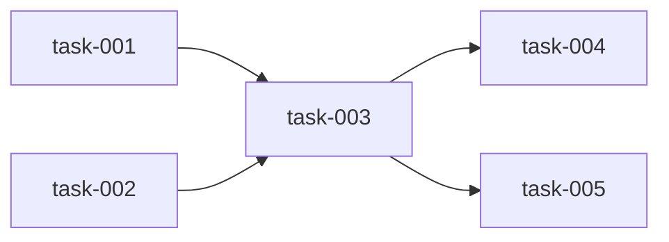

# [プロジェクト名] 仕様書（SPEC）

> このテンプレートを使用してSPECを作成してください。
> 角括弧 `[...]` 内は実際の内容に置き換えてください。

## 1. 概要

### 1.1 目的
[このプロジェクト/機能が解決する問題と、達成したい目標を記述]

### 1.2 背景
[なぜこのプロジェクト/機能が必要になったか、経緯を記述]

### 1.3 スコープ

#### 含まれるもの
- [実装する機能1]
- [実装する機能2]
- [実装する機能3]

#### 含まれないもの
- [今回は対象外の機能1]
- [今回は対象外の機能2]

---

## 2. 機能要件

### 2.1 機能一覧

| ID | 機能名 | 説明 | 優先度 |
|----|-------|------|--------|
| F-001 | [機能名] | [簡潔な説明] | 高/中/低 |
| F-002 | [機能名] | [簡潔な説明] | 高/中/低 |
| F-003 | [機能名] | [簡潔な説明] | 高/中/低 |

### 2.2 機能詳細

#### F-001: [機能名]

**概要**: [機能の目的と概要]

**入力**:
- [入力項目1]: [型/形式] - [説明]
- [入力項目2]: [型/形式] - [説明]

**出力**:
- [出力項目1]: [型/形式] - [説明]

**処理フロー**:
1. [処理ステップ1]
2. [処理ステップ2]
3. [処理ステップ3]

**エラーケース**:
- [エラー条件1] → [エラー処理]
- [エラー条件2] → [エラー処理]

---

## 3. 非機能要件

### 3.1 パフォーマンス
- レスポンスタイム: [目標値、例: 200ms以内]
- スループット: [目標値、例: 1000 req/sec]
- 同時接続数: [目標値、例: 100]

### 3.2 セキュリティ
- 認証: [方式、例: JWT]
- 認可: [方式、例: RBAC]
- データ暗号化: [対象と方式]
- 監査ログ: [記録する項目]

### 3.3 可用性
- 稼働率目標: [例: 99.9%]
- 障害復旧時間: [例: 1時間以内]
- バックアップ: [方針]

### 3.4 保守性
- ログ出力: [方針]
- モニタリング: [監視項目]
- アラート: [閾値と通知先]

---

## 4. 技術的制約

### 4.1 技術スタック
- 言語: [例: TypeScript 5.x]
- フレームワーク: [例: Next.js 14]
- データベース: [例: PostgreSQL 15]
- インフラ: [例: AWS / GCP]

### 4.2 外部依存
- [外部サービス1]: [用途と依存度]
- [外部サービス2]: [用途と依存度]

### 4.3 制限事項
- [技術的な制限1]
- [技術的な制限2]
- [予算/リソースの制限]

---

## 5. 受入基準

### 5.1 機能テスト基準

| ID | 基準 | 検証方法 |
|----|------|---------|
| AC-001 | [検証可能な基準] | [テスト方法] |
| AC-002 | [検証可能な基準] | [テスト方法] |
| AC-003 | [検証可能な基準] | [テスト方法] |

### 5.2 非機能テスト基準

| ID | 基準 | 検証方法 |
|----|------|---------|
| AC-NF-001 | [パフォーマンス基準] | [負荷テスト方法] |
| AC-NF-002 | [セキュリティ基準] | [セキュリティテスト方法] |

---

## 6. タスク分割案

### 6.1 タスク一覧

| タスク | 説明 | 見積もり | 優先度 |
|--------|------|---------|--------|
| task-001 | [タスク説明] | [時間] | 高/中/低 |
| task-002 | [タスク説明] | [時間] | 高/中/低 |
| task-003 | [タスク説明] | [時間] | 高/中/低 |

### 6.2 依存関係

### 6.3 Wave分割案

#### Wave 1（並行実行可能）
- task-001: [説明]
- task-002: [説明]

#### Wave 2（Wave 1完了後）
- task-003: [説明] (depends: task-001, task-002)

#### Wave 3（Wave 2完了後）
- task-004: [説明] (depends: task-003)
- task-005: [説明] (depends: task-003)

---

## 7. リスクと対策

| リスク | 影響度 | 発生確率 | 対策 |
|--------|-------|---------|------|
| [リスク1] | 高/中/低 | 高/中/低 | [対策] |
| [リスク2] | 高/中/低 | 高/中/低 | [対策] |

---

## 8. 用語集

| 用語 | 定義 |
|------|------|
| [用語1] | [定義] |
| [用語2] | [定義] |

---

## 変更履歴

| 日付 | 版 | 変更内容 | 変更者 |
|------|---|---------|--------|
| [日付] | 1.0 | 初版作成 | [名前] |
